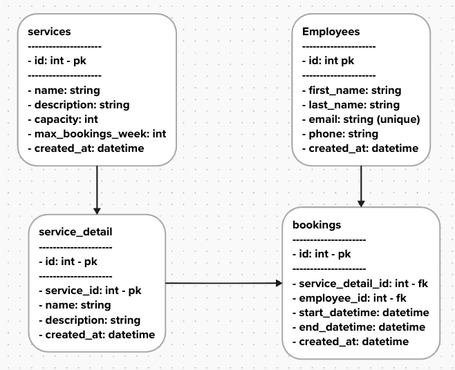

# Booking System

A booking system where employees can reserve desks, office spaces, or parking spots from a single application.

## Technology Stack

| Layer        | Technology                      |
| ------------ | ------------------------------- |
| **Backend**  | .NET 8 (API, EF Core, Identity) |
| **Frontend** | Angular 19                      |
| **Database** | SQLite                          |

## Data Structure



## Project Structure

```
booking-repo/
├── backend/    # .NET 8 API (see backend/README.md)
├── frontend/   # Angular app (see frontend/README.md)
└── booking-app-seed-data.json
```

Refer to each project's README for setup instructions, prerequisites, and available commands:

- [Backend README](backend/README.md)
- [Frontend README](frontend/README.md)
